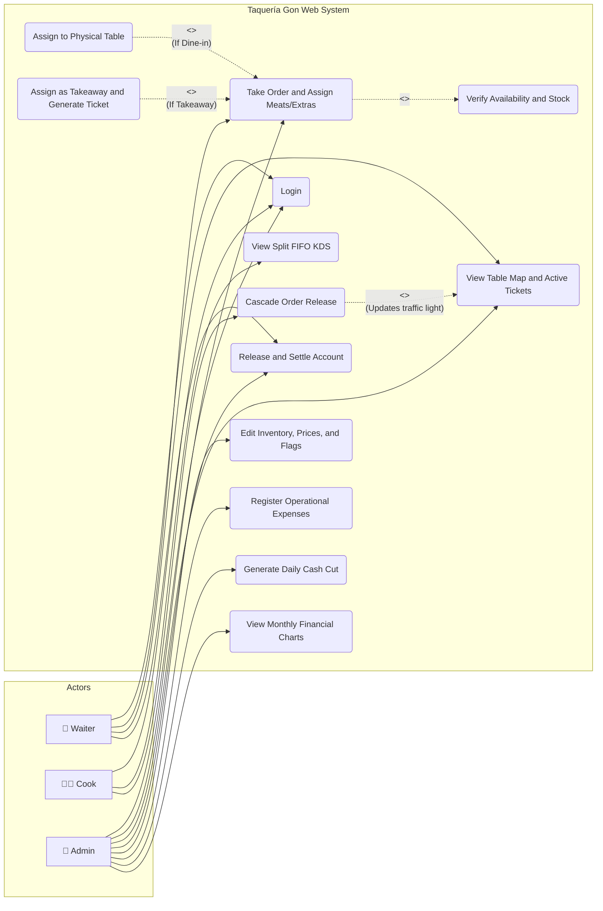
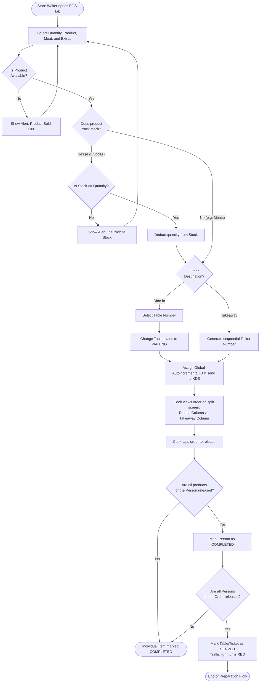
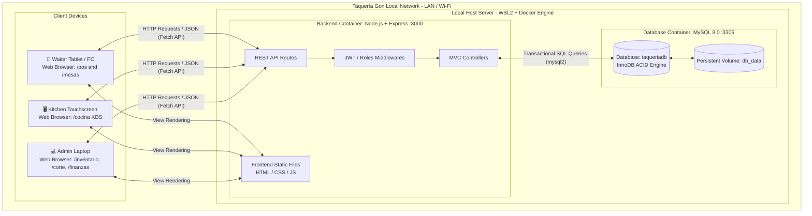

## UML Use Case Diagram

```mermaid
flowchart LR
    subgraph Actors
        W[👤 Waiter]
        C[👨‍🍳 Cook]
        A[👔 Admin]
    end

    subgraph Taquería Gon Web System
        UC1(Login)
        UC2(Take Order and Assign Meats/Extras)
        UC3(Assign to Physical Table)
        UC4(Assign as Takeaway and Generate Ticket)
        UC5(Verify Availability and Stock)
        UC6(View Table Map and Active Tickets)
        UC7(Release and Settle Account)
        UC8(View Split FIFO KDS)
        UC9(Cascade Order Release)
        UC10(Edit Inventory, Prices, and Flags)
        UC11(Register Operational Expenses)
        UC12(Generate Daily Cash Cut)
        UC13(View Monthly Financial Charts)
    end

    W --> UC1 & UC2 & UC6 & UC7
    C --> UC1 & UC8 & UC9
    A --> UC1 & UC2 & UC6 & UC7 & UC10 & UC11 & UC12 & UC13

    UC2 -. "<<include>>" .-> UC5
    UC3 -. "<<extend>>\n(If Dine-in)" .-> UC2
    UC4 -. "<<extend>>\n(If Takeaway)" .-> UC2
    UC9 -. "<<include>>\n(Updates traffic light)" .-> UC6
```

---
## UML Activity Diagram: Order Taking & KDS

```mermaid
flowchart TD
    Start([Start: Waiter opens POS tab]) --> SelProd[Select Quantity, Product, Meat, and Extras]
    SelProd --> CheckDisp{Is Product\nAvailable?}
    
    CheckDisp -- No --> AlertNoDisp[Show Alert: Product Sold Out] --> SelProd
    CheckDisp -- Yes --> CheckCtrlStock{Does product\ntrack stock?}
    
    CheckCtrlStock -- Yes (e.g. Sodas) --> CheckCant{Is Stock >= Quantity?}
    CheckCant -- No --> AlertNoStock[Show Alert: Insufficient Stock] --> SelProd
    CheckCant -- Yes --> SubStock[Deduct quantity from Stock] --> Dest
    
    CheckCtrlStock -- No (e.g. Meats) --> Dest{Order\nDestination?}
    
    Dest -- Dine-in --> SelTable[Select Table Number]
    SelTable --> ChangeYellow[Change Table status to WAITING]
    
    Dest -- Takeaway --> GenTicket[Generate sequential Ticket Number]
    
    ChangeYellow & GenTicket --> AssignID[Assign Global Autoincremental ID & send to KDS]
    
    AssignID --> KDS[Cook views order on split screen:\nDine-in Column vs Takeaway Column]
    KDS --> CookTask[Cook taps order to release]
    
    CookTask --> Cascade1{Are all products\nfor the Person released?}
    Cascade1 -- No --> EndPartial([Individual Item marked COMPLETED])
    Cascade1 -- Yes --> LibPerson[Mark Person as COMPLETED]
    
    LibPerson --> Cascade2{Are all Persons\nin the Order released?}
    Cascade2 -- No --> EndPartial
    Cascade2 -- Yes --> OrderServed[Mark Table/Ticket as SERVED\nTraffic light turns RED]
    OrderServed --> End([End of Preparation Flow])
```

---
## UML Component and Deployment Diagram (Docker)

```mermaid
flowchart TB
    subgraph Taquería Gon Local Network - LAN / Wi-Fi
        direction LR
        subgraph Client Devices
            T1[📱 Waiter Tablet / PC\nWeb Browser: /pos and /mesas]
            T2[🖥️ Kitchen Touchscreen\nWeb Browser: /cocina KDS]
            T3[💻 Admin Laptop\nWeb Browser: /inventario, /corte, /finanzas]
        end

        subgraph Local Host Server - WSL2 + Docker Engine
            subgraph Backend Container: Node.js + Express :3000
                Routes[REST API Routes]
                MW[JWT / Roles Middlewares]
                Ctrl[MVC Controllers]
                Front[Frontend Static Files\nHTML / CSS / JS]
            end

            subgraph Database Container: MySQL 8.0 :3306
                DB[(Database: taqueriadb\nInnoDB ACID Engine)]
                Vol[(Persistent Volume: db_data)]
            end
        end
    end

    T1 & T2 & T3 <-- "HTTP Requests / JSON (Fetch API)" --> Routes
    T1 & T2 & T3 <-- "View Rendering" --> Front
    Routes --> MW --> Ctrl
    Ctrl <-- "Transactional SQL Queries (mysql2)" --> DB
    DB <--> Vol
```