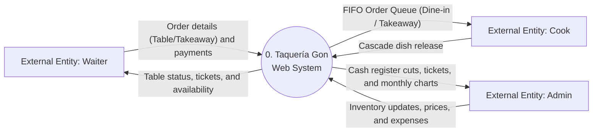
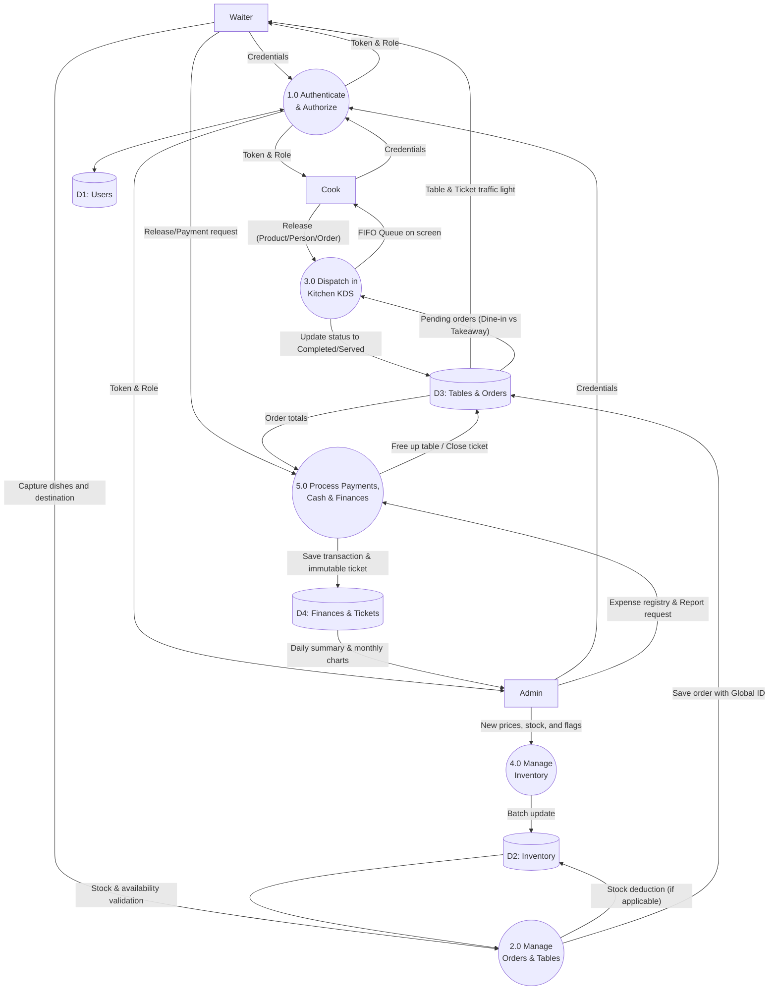

### Data Flow Diagrams (DFD)

### Level 0: Context Diagram

```mermaid
flowchart LR
    Waiter[External Entity: Waiter]
    Cook[External Entity: Cook]
    Admin[External Entity: Admin]
    
    System((0. Taquería Gon\nWeb System))

    Waiter -- "Order details (Table/Takeaway) and payments" --> System
    System -- "Table status, tickets, and availability" --> Waiter

    System -- "FIFO Order Queue (Dine-in / Takeaway)" --> Cook
    Cook -- "Cascade dish release" --> System

    Admin -- "Inventory updates, prices, and expenses" --> System
    System -- "Cash register cuts, tickets, and monthly charts" --> Admin
```

### Level 1: Process Decomposition

```mermaid
flowchart TD
    Waiter[Waiter]
    Cook[Cook]
    Admin[Admin]

    P1((1.0 Authenticate\n& Authorize))
    P2((2.0 Manage\nOrders & Tables))
    P3((3.0 Dispatch in\nKitchen KDS))
    P4((4.0 Manage\nInventory))
    P5((5.0 Process Payments,\nCash & Finances))

    D1[(D1: Users)]
    D2[(D2: Inventory)]
    D3[(D3: Tables & Orders)]
    D4[(D4: Finances & Tickets)]

    Waiter & Cook & Admin -- Credentials --> P1
    P1 <--> D1
    P1 -- Token & Role --> Waiter & Cook & Admin

    Waiter -- Capture dishes and destination --> P2
    D2 -- Stock & availability validation --> P2
    P2 -- Stock deduction (if applicable) --> D2
    P2 -- Save order with Global ID --> D3
    D3 -- Table & Ticket traffic light --> Waiter

    D3 -- Pending orders (Dine-in vs Takeaway) --> P3
    P3 -- FIFO Queue on screen --> Cook
    Cook -- Release (Product/Person/Order) --> P3
    P3 -- Update status to Completed/Served --> D3

    Admin -- New prices, stock, and flags --> P4
    P4 -- Batch update --> D2

    Waiter -- Release/Payment request --> P5
    Admin -- Expense registry & Report request --> P5
    D3 -- Order totals --> P5
    P5 -- Free up table / Close ticket --> D3
    P5 -- Save transaction & immutable ticket --> D4
    D4 -- Daily summary & monthly charts --> Admin
```